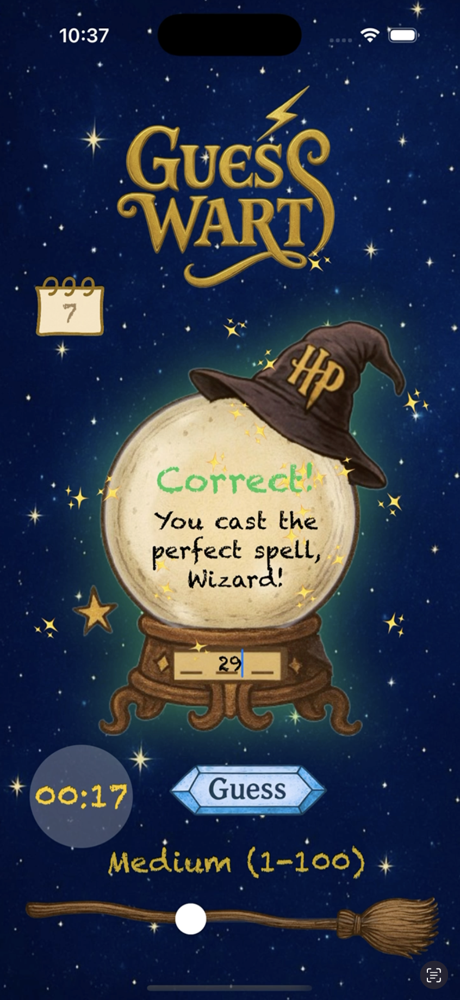
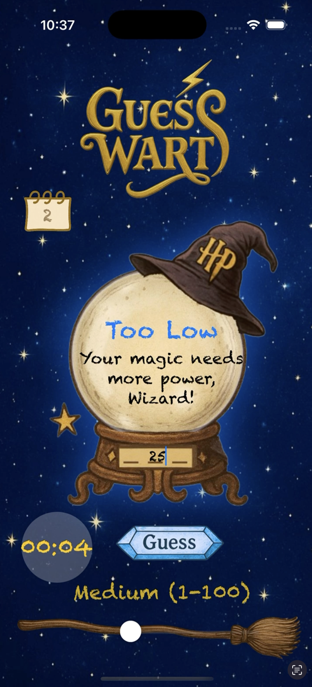
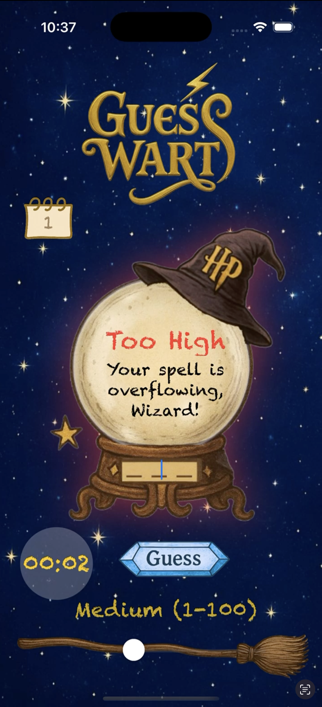

# GuessWarts

**GuessWarts** is an interactive word-guessing game built with **SwiftUI**. The app combines a playful Harry Potter-inspired theme with an interactive guessing experience.

## Features

- Interactive word-guessing gameplay
- Custom SwiftUI interface
- Score and game-state tracking
- Custom app icons and visual assets
- User-friendly game experience

## Technologies

- Swift
- SwiftUI
- Xcode

## My Role

I designed and developed GuessWarts, including the user interface, game logic, and visual assets.

## Screenshots

## Demo
https://youtu.be/7JoheLgGeH8?si=dvEkFI30U4bHxa-W
## Project

This project was created as part of my journey learning Swift and iOS app development.
